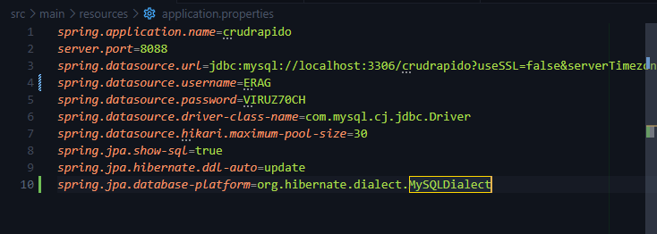
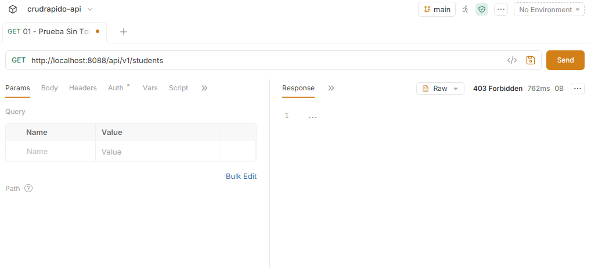
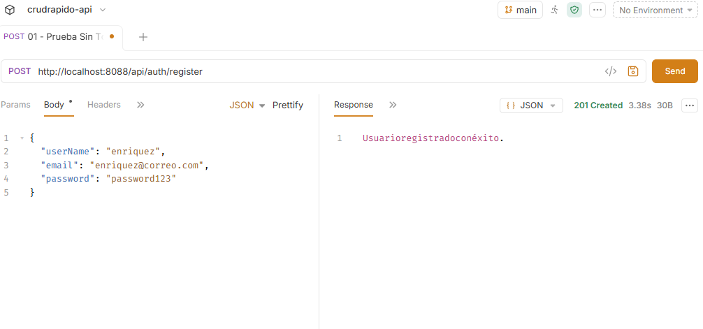
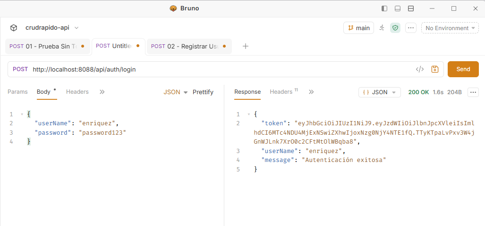
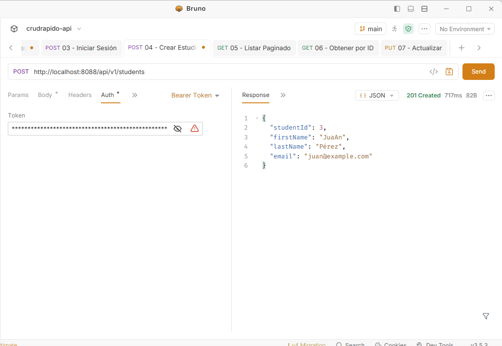
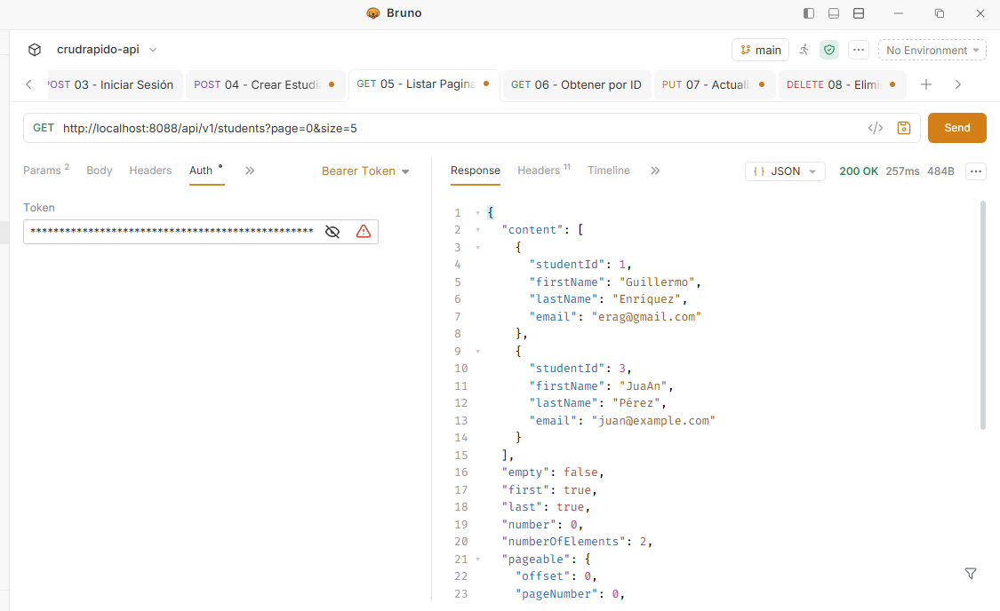
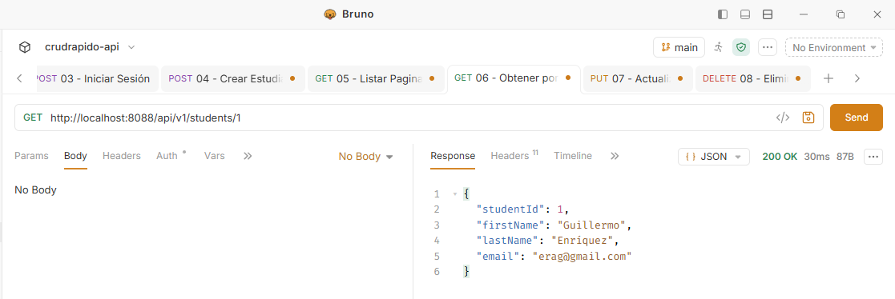
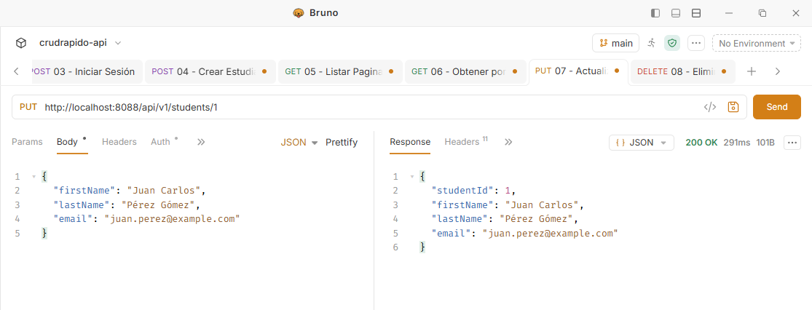
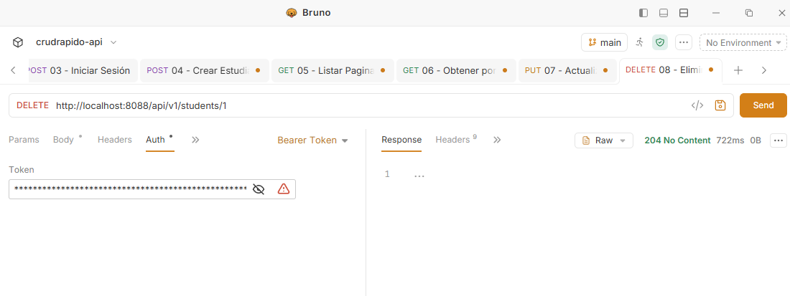

<div align="center">

# Instituto Tecnológico Nacional de México

### Instituto Tecnológico de Oaxaca

**Carrera:** Ingeniería en Sistemas Computacionales <br><br>
**Materia:** Programación Web<br><br>
**Actividad:** Act4. API REST Segura con Spring Security, JWT y Paginación<br><br>
**Docente:** Adelina Martínez Nieto<br><br>
**Integrante:** Enríquez Rodríguez Alejandro Guillermo<br><br>
**Fecha de entrega:** 20 de julio del 2026<br><br>

</div>

# Act4 T4 — API REST Segura con Spring Boot, JWT, MySQL y VPS

## Descripción del proyecto

API REST de gestión de estudiantes (`crudrapido`) construida con **Spring Boot + Spring Data JPA**, conectada a **MySQL**, protegida con **Spring Security** y **JWT**, con paginación de resultados y DTOs, desplegada en un servidor VPS. Esta actividad conecta lo aprendido en las Actividades 2 y 3 (DTOs, Entity, Repository, Service, relaciones JPA) agregando autenticación real.

---

## Configuración de la base de datos



---

## Pruebas de la API probadas con Bruno

### Prueba de acceso denegado (sin token)
Confirmación de que un endpoint protegido rechaza correctamente una petición sin token válido.



### Autenticación (rutas públicas)

**Registro de usuario:**


**Login y generación de token JWT:**


### CRUD de estudiantes (protegido con JWT)

**Crear estudiante (POST):**


**Listar estudiantes paginado (GET):**


**Obtener estudiante por ID (GET):**


**Actualizar estudiante (PUT):**


**Eliminar estudiante (DELETE):**


---

## Documentación técnica

### Autenticación y seguridad
- Las rutas `/api/auth/**` (registro y login) son públicas.
- Todas las rutas bajo `/api/v1/students/**` requieren un token JWT válido en la cabecera `Authorization: Bearer <TOKEN>`.
- `JwtAuthenticationFilter` intercepta cada petición, valida el token con `JwtUtils`, y si es válido, establece la autenticación en el contexto de seguridad antes de que la petición llegue al controlador.
- Las contraseñas se guardan cifradas con `BCryptPasswordEncoder`, nunca en texto plano.

### DTOs
Se usan DTOs (`StudentDTO`, `RegisterRequest`, `LoginRequest`, `AuthResponse`) para controlar exactamente qué datos entran y salen de la API, evitando exponer directamente las entidades JPA o datos sensibles como la contraseña.

### Validación
Los DTOs de entrada usan Bean Validation (`@NotBlank`, `@Email`, `@Size`) junto con `@Valid` en los controladores, regresando errores claros si los datos no cumplen el formato esperado.

### Paginación
El listado de estudiantes usa `Pageable` de Spring Data, permitiendo controlar la página y el tamaño con parámetros de consulta (`?page=0&size=5`).

### Códigos de estado HTTP
Los controladores usan `ResponseEntity` para regresar códigos apropiados: `201` al crear, `200` al consultar/actualizar correctamente, `404` cuando el recurso no existe, y `400` cuando la validación falla.

---

## Endpoints

| Método | Ruta | Seguridad | Descripción |
|---|---|---|---|
| POST | `/api/auth/register` | Público | Registro de usuario |
| POST | `/api/auth/login` | Público | Login y obtención de token JWT |
| GET | `/api/v1/students` | Requiere JWT | Listado paginado de estudiantes |
| GET | `/api/v1/students/{id}` | Requiere JWT | Obtener estudiante por ID |
| POST | `/api/v1/students` | Requiere JWT | Crear estudiante |
| PUT | `/api/v1/students/{id}` | Requiere JWT | Actualizar estudiante |
| DELETE | `/api/v1/students/{id}` | Requiere JWT | Eliminar estudiante |

---

## Estructura del proyecto

```
ERAGact4_t4/
├── pom.xml
├── screenshots/
├── bruno/
│   └── crudrapido-api-bruno/
└── src/
    └── main/
        ├── java/com/enriquez/crudrapido/
        │   ├── CrudrapidoApplication.java
        │   ├── controller/
        │   │   ├── AuthController.java
        │   │   └── StudentController.java
        │   ├── dto/
        │   │   ├── LoginRequest.java
        │   │   ├── RegisterRequest.java
        │   │   ├── AuthResponse.java
        │   │   └── StudentDTO.java
        │   ├── entity/
        │   │   ├── User.java
        │   │   └── Student.java
        │   ├── repository/
        │   ├── security/
        │   │   ├── SecurityConfig.java
        │   │   ├── JwtAuthenticationFilter.java
        │   │   └── JwtUtils.java
        │   └── service/
        │       └── StudentService.java
        └── resources/
            └── application.properties
```

---

## Tecnologías utilizadas

- **Java 21**
- **Spring Boot** (Spring Web, Spring Security, Spring Data JPA)
- **JSON Web Token (JWT)** — `jjwt`
- **MySQL**
- **Bruno** — cliente HTTP para probar y documentar la API
- **Git / GitHub**

---

## Puertos usados en el VPS

- Actividad 1: puerto **8082**
- Actividad 2: puerto **8084**
- Actividad 3: puerto **8086**
- Actividad 4: puerto **8088**

---

## Ver en vivo

🔗 **Repositorio:** https://github.com/AlejandroGuillermo7/ERAGact4_t4

🔗 **Proyecto en el VPS:**
- `http://67.207.87.232:8088/api/auth/register`
- `http://67.207.87.232:8088/api/auth/login`
- `http://67.207.87.232:8088/api/v1/students`

- Todas las rutas bajo /api/v1/students/** requieren un token JWT válido en la cabecera Authorization: Bearer <TOKEN>.
- `POST` `http://67.207.87.232:8088/api/auth/login` (Obtener Token)
- `GET` `http://67.207.87.232:8088/api/v1/students` (Endpoint Protegido con JWT)


🔗 **Colección de Bruno:** incluida en la carpeta `bruno/` de este repositorio.

---

## Autor

**Alejandro Guillermo Enríquez Rodríguez**
Estudiante de Ingeniería en Sistemas Computacionales — Instituto Tecnológico de Oaxaca